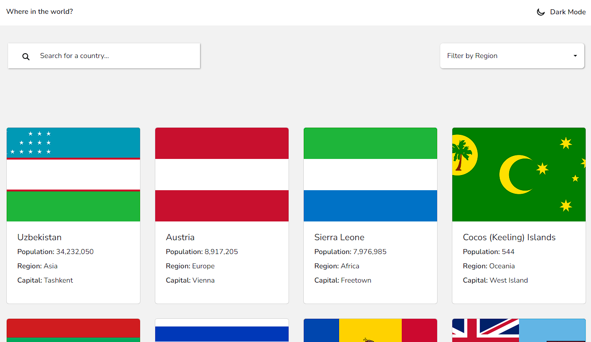
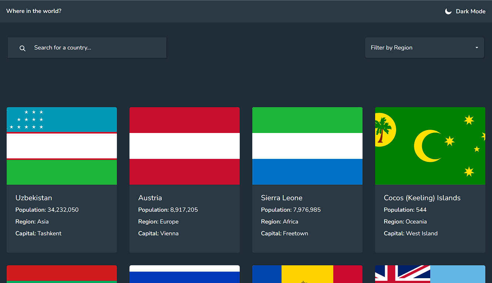
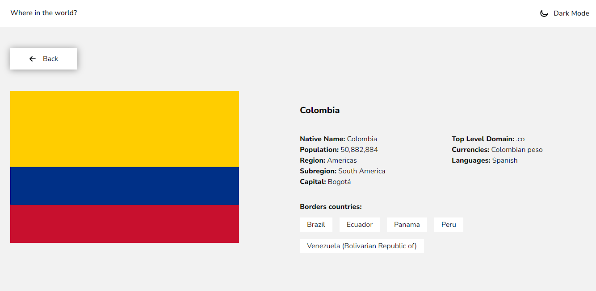
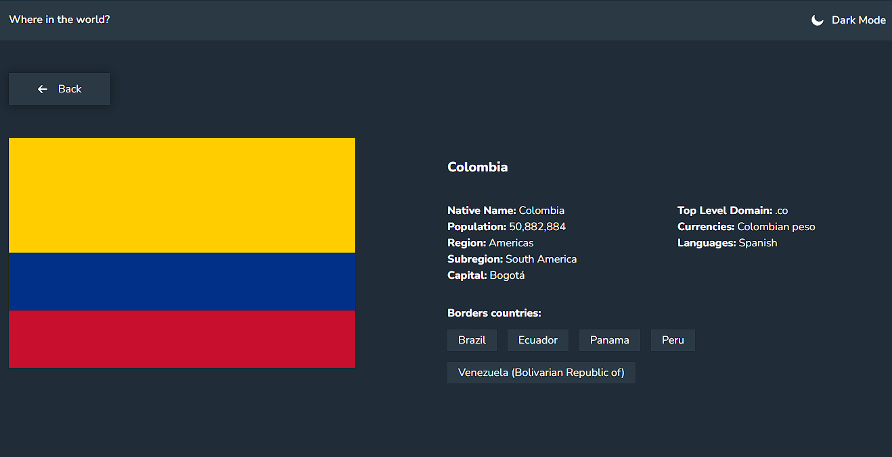
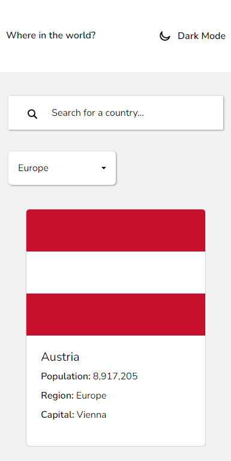
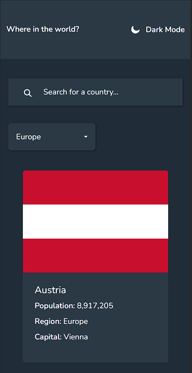
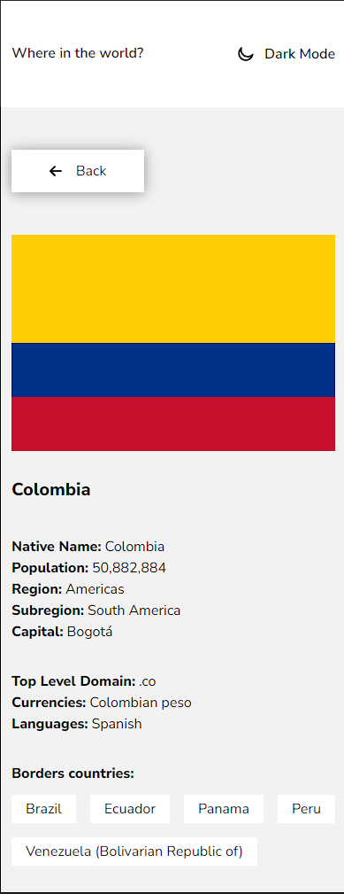
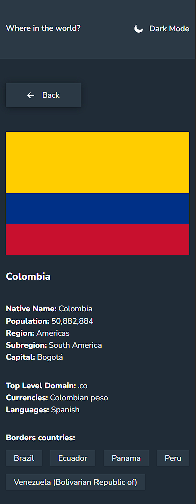

# Frontend Mentor - REST Countries API with color theme switcher solution

This is a solution to the [REST Countries API with color theme switcher challenge on Frontend Mentor](https://www.frontendmentor.io/challenges/rest-countries-api-with-color-theme-switcher-5cacc469fec04111f7b848ca). Frontend Mentor challenges help you improve your coding skills by building realistic projects. 

## Table of contents

- [Overview](#overview)
  - [The challenge](#the-challenge)
  - [Screenshot](#screenshot)
  - [Links](#links)
- [My process](#my-process)
  - [Built with](#built-with)
  - [What I learned](#what-i-learned)
  - [Continued development](#continued-development)
- [Author](#author)

**Note: Delete this note and update the table of contents based on what sections you keep.**

## Overview

### The challenge

Users should be able to:

- See all countries from the API on the homepage
- Search for a country using an `input` field
- Filter countries by region
- Click on a country to see more detailed information on a separate page
- Click through to the border countries on the detail page
- Toggle the color scheme between light and dark mode *(optional)*

### Screenshot

#### Desktop screenshots
Home Desktop Light



Home Desktop Dark



Details Desktop Light



Details Desktop Dark



#### Mobile screenshots
Home Mobile Light



Home Mobile Dark



Details Mobile Light



Details Mobile Dark



### Links

- Solution URL: [Source code](https://github.com/coronellw/countries-api)
- Live Site URL: [Vercel hosted app](https://countries-api-pi-nine.vercel.app/)

## My process

### Built with

- Semantic HTML5 markup
- CSS custom properties
- Flexbox
- CSS Grid
- Mobile-first workflow
- [React](https://reactjs.org/) - JS library
- [React-router-dom](https://reactrouter.com/) - Routing library for react
- [bootstrap](https://styled-components.com/) - For styles (Mostly for dropdown and containers)
- [fontAwesome](https://fontawesome.com/) - Library for Icons

**Note: These are just examples. Delete this note and replace the list above with your own choices**

### What I learned

Use this section to recap over some of your major learnings while working through this project. Writing these out and providing code samples of areas you want to highlight is a great way to reinforce your own knowledge.

To see how you can add code snippets, see below:

```html
<h1>Some HTML code I'm proud of</h1>
```
```css
.proud-of-this-css {
  color: papayawhip;
}
```
```js
const proudOfThisFunc = () => {
  console.log('🎉')
}
```

### Continued development

- Handling error pages: Despite using `react-router-dom` to handle the errors in the site, it was not possible to display the error page within the chosen deployment site (vercel)

## Author

- Frontend Mentor - [@yourusername](https://www.frontendmentor.io/profile/coronellw)
- Twitter - [@@Coronellw](https://www.twitter.com/Coronellw)

